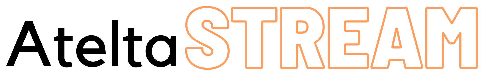

## **AteltaAI Streamer** 

<p align="center" width="100%">
     
</p>

Official repository for **AteltaAI** Streamer SDK. This repository helps to establish the two video streams  across different types of video sources. We are pushing a lot of changes. So keep an update, do star 🌟 the project. 

## Features provided by AteltaStream till now ✨:

- Download any youtube video from internet, paste the link to get instructed from that video. 
- User can also upload private videos for the same.
- Single instructor focussed tracking for multi person videos (BETA)
- Automatic one time pre-processing of the instructor's video.
- Realtime User keypoints detection and tracking to match it with the instructors side by side 
- Real time side by side user and instructor video streaming with sound.

## **How to run the project ⚙**

`Simply running locally`

You can run the project by first installing the dependencies by typing:
```
pip install -r requirements.txt
```
Then start the app by running:
```
PYTHONPATH=. streamlit run app/app.py
```

`Building docker image`

You can also build the docker image and run the same to run the application. To build the docker image just run 
```
make build_image
```
Once the image is created, start the app by running:
```
docker run --privileged --device /dev/video0:/dev/video0  atelta-streamer:latest
```
This must work on `linux` distributions and `macos`. But there might be issues with `windows`. As there are different ways to give access to camera to the host.

## **Roadmap and future features:🚦**

- Real time batched metrics to compare the actions performed by the user and the instructor.
- Metrics for engagement of the user during the session 
- Making UI better 
- Tracking all the metrics and upload to database  
- Video Streamer with gesture/motion controllers for:
    - Seeking forward / backward
    - Pause 
    - Resume
    - Slow down 
    - Speed up (Might not required)

## **How to Contribute to this project 😄**

Contributing guidelines will be released soon. Till then you can start with pre-existing issues or create new ones. For new issues, We will try to first review and then once approved, you are free to contribute to that. 